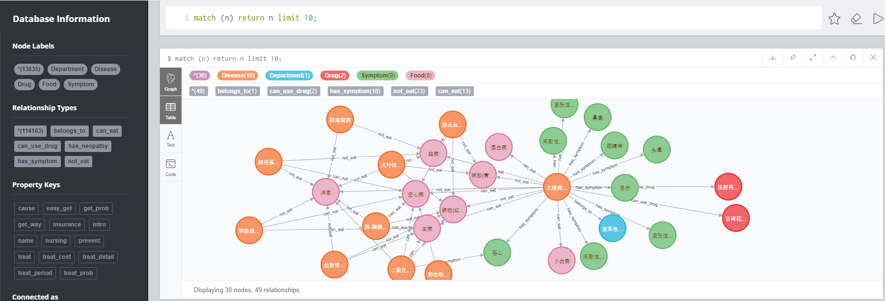

# 说明
- 本程序实现的是中文的医疗知识图谱的自动问答机器人MedicalKBQA，是基于新版的[rasa-1.1.8](https://rasa.com/)版本及其支持的外部组件实现的，并使用了图数据库neo4j构建知识图谱。

- 会话管理使用的是rasa-core，rasa的pipeline配置如下：
        
      pipeline:
      - name: "MitieNLP"
      model: "data/total_word_feature_extractor_zh.dat"
      - name: "JiebaTokenizer"
      dictionary_path: "jieba_userdict"
      - name: "MitieEntityExtractor"
      - name: "EntitySynonymMapper"
      - name: "RegexFeaturizer"
      - name: "MitieFeaturizer"
      - name: "SklearnIntentClassifier"

- *注意*： rasa-nlu和rasa-core已经合并成rasa

- Rasa训练数据集的构造： 使用到了[Chatito工具](https://rodrigopivi.github.io/Chatito/)

# 配置环境（python==3.6.8）
1. 下载zip包或者git clone 

2. 进入Doctor-Friende目录，conda记得activate环境

2. 然后在命令行使用

       pip install -r requirements.txt

3. *提示*：

    - 国内推荐使用镜像加速，比如：
    
          pip install -i https://pypi.tuna.tsinghua.edu.cn/simple -r requirements.txt
    
    - 如果你有代理，可以在pip install命令后加上 --proxy=地址:端口

# 数据导入neo4j
- 前提是已经有了可以连接的neo4j graph

- 修改MedicalSpider.process_data下的create_graph.py，把neo4j数据库的链接信息改成你自己的，然后运行该文件
（为了防止路径问题，建议使用pycharm打开本项目后运行）

- *关于爬虫*：爬虫实现是使用了[scrapy](https://scrapy.org/)库，若想运行，可以在Doctor-Friende目录下运行SpiderMain.py

- 整体规模：
    - 13,635 nodes (5 labels)
    - 114,163 relationships (6 types)

- 数据结构

| 实体类型 | 含义 | 数量 | 举例 |  
| :--- | :---: | :---: | :--- |  
| Disease | 疾病 | 6,143 |  百日咳\n头痛|  
| Department | 科室 | 54 |  儿科\n小儿内科|  
| Drug | 药品 | 1,124 |  硫辛酸片\n曲克芦丁片|  
| Food | 食物 | 378 |  蟹肉\n鱿鱼(干)|  
| Symptom | 疾病症状 | 5,936 |  角弓反张\n视网膜Roth斑|  
| Total | 总计 | 13,635 | 约1.3万实体量级|  

# 运行bot
1. 下载用于mitie的模型文件放到chat/data文件夹下，[百度网盘](https://pan.baidu.com/s/1kNENvlHLYWZIddmtWJ7Pdg)，密码：p4vx，
或者[Mega云盘](https://mega.nz/#!EWgTHSxR!NbTXDAuVHwwdP2-Ia8qG7No-JUsSbH5mNQSRDsjztSA)

1. chat/MyActions下的actions.py中同样需要先把neo4j数据库的链接信息改成你自己的

1. 打开2个终端，都cd到chat目录下，conda记得activate环境  

1. 一个终端（启动Action Server）

       rasa run actions --actions MyActions.actions --cors "*" -vv  

1. 另一个终端（启动NLU & Core Server）

       rasa run --enable-api -m models/medical-final-m3/20190728-212653.tar.gz --port 5000 --endpoints config/endpoints.yml --credentials config/credentials.yml -vv

1. 前端页面位于：

1. *提示*：

    - 更推荐使用nohup等类似的方式在后台运行 ，并将控制台输出指向指定的文件。 

# 参考
- 刘焕勇老师的[QABasedOnMedicalKnowledgeGraph](https://github.com/liuhuanyong/QASystemOnMedicalKG)  

- 国内作者写的[Rasa_NLU_Chi](https://github.com/crownpku/Rasa_NLU_Chi)，已经被rasa收入官方文档了，新版rasa已经有支持中文的方式了。
 
- 前端设计参考[WeatherBot](https://github.com/howl-anderson/WeatherBot)，此项目采用的是nlu和core合并前的rasa。

- 所以前端使用了webchat.js，[rasa-webchat](https://github.com/mrbot-ai/rasa-webchat)

- [Scrapy](https://scrapy.org)

- [Neo4j](https://neo4j.org)

- [py2neo](https://py2neo.org)

- [rasa-doc](https://rasa.com/docs)或者旧版[legacy-rasa-doc](https://legacy-docs.rasa.com/docs/)建议先看第一个
  
- [rasa-forum](https://forum.rasa.com/)论坛上也会有很多问题的讨论，可以搜索  

# TODO
- 上传前端项目
- ~~写report~~
- 优化readme

## 如有问题可以issue